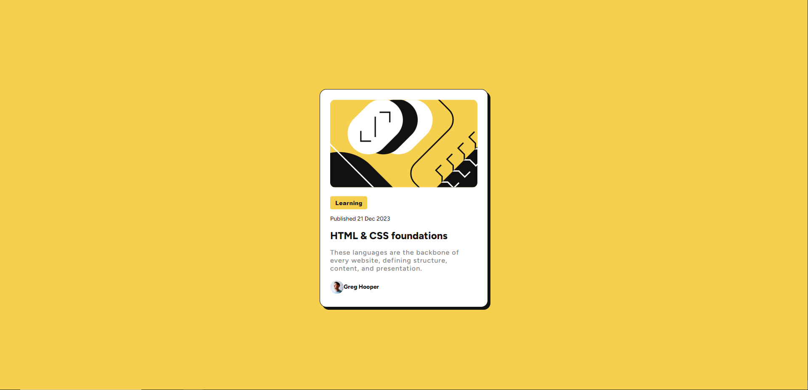

# Frontend Mentor - Blog preview card solution

This is a solution to the [Blog preview card challenge on Frontend Mentor](https://www.frontendmentor.io/challenges/blog-preview-card-ckPaj01IcS).

## Table of contents

- [Overview](#overview)
  - [Screenshot](#screenshot)
  - [Links](#links)
- [My process](#my-process)
  - [Built with](#built-with)
  - [What I learned](#what-i-learned)
- [Author](#author)

## Overview

Building a blog preview card using the provided design file, for desktop and mobile view

### Screenshot

### Links

[Solution URL](https://github.com/Antonvasilache/blog-preview-card)
[Live Site URL](https://blog-preview-card-av.netlify.app/)

## My process

1. Wrote down the html structure and added the content.
2. Added flex containers.
3. Resized the images to have a better overview of the page.
4. Centered the container to the viewport.
5. Added padding and border radius.
6. Added fonts and colors as per the style guide.
7. Added active state to the indicated elements.
8. Added Shadows.
9. Adjusted padding and margins to visually match the design file.

### Built with

- Semantic HTML5 markup
- CSS custom properties
- Flexbox

### What I learned

- Adding images from svg files using the img tag.
- Creating shadows using the box-shadow property.
- Creating an active state with various behaviours.

## Author

- Website - [Antonvasilache.com](https://www.antonvasilache.com)
- Frontend Mentor - [@Antonvasilache](https://www.frontendmentor.io/profile/Antonvasilache)
